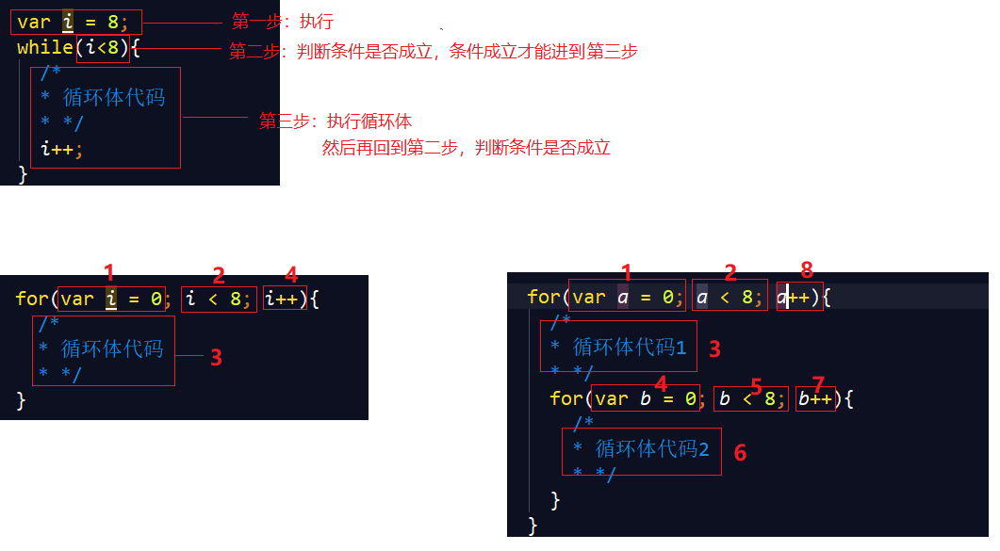

##JavaScript介绍
  JavaScript是运行在浏览器端的脚步语言，JavaScript主要解决的是前端与用户交互的问题，包括使用交互与数据交互。 JavaScript是浏览器解释执行的，前端脚本语言还有JScript（微软，IE独有），ActionScript( Adobe公司，需要插件)等。
##JavaScript的组成
  1、ECMAscript javascript的语法（变量、函数、循环语句等语法）
  2、DOM 文档对象模型 操作html和css的方法
  3、BOM 浏览器对象模型 操作浏览器的一些方法
##javascript嵌入页面的方式
  1、页面script标签嵌入
~~~js
 
~~~
  2、外部引入
~~~js

~~~
  3、行间事件（主要用于事件）
~~~js
<input type="button" name="" onclick="alert('ok！');">
~~~
##js五句话
~~~js
alert("你好！");         // 在浏览器中弹出提示框，并带一个确定按钮
confirm("确定吗？");     // 信息框，带一个确定按钮，点击返回true值，一个取消按钮，点击返回false值
prompt("输入一个数字");   //弹出一个输入框，点击确定按钮，返回输入的值
console.log(123);        //在控制台输出
document.write("内容内容");  //在html结构的body里面打印 "内容内容"
~~~
##变量
JavaScript 是一种弱类型语言，javascript的变量类型由它的值来决定。 定义变量需要用关键字 'var'
~~~js
var a = 123;
var b = 'asd';

 //同时定义多个变量可以用","隔开，公用一个‘var’关键字
 var c = 45,d='qwe',f='68';
~~~
注意：变量名如果重复，后面的变量会覆盖前面的变量（不同局部作用域环境的情况除外，后面再讲）
~~~js
var a = 123;
//省略一千行代码
var a = 'abc';
console.log(a);   //abc
~~~
####变量类型
5种基本数据类型：
number、string、boolean、undefined、null

1种复合类型：
object
    --数组 Array
    --时间 Date
    --函数 Function 
    ......
####类型转换
**隐式转换**

      --string 转 number
        加、减、乘、除符号"123" --->  123 
        注意：这里只能转数字字符串,如果 +'123a'  ---> NaN

      --number 转 string
        console.log(""+123 );  //"123"

      --其他数据类型取反 转 boolean
        console.log(!0);       //true
        console.log(!"abc");   //false

      --判断条件里面隐式 转 boolean
        if(3){
          console.log("true");  //输出true
        }else{
          console.log("false");
        }

**强制转换**
1、强制转成number  parseInt() 与 parseFloat() 或 Number()
~~~js
alert('12'+7); //弹出127
alert( parseInt('12') + 7 );  //弹出19 
alert( parseInt(5.6));  // 弹出5
alert('5.6'+2.3);  // 弹出5.62.3
alert(parseFloat('5.6')+2.3);  // 弹出7.8999999999999995
alert(0.1+0.2); //弹出 0.3000000000000004
alert((0.1*100+0.2*100)/100); //弹出0.3
alert((parseFloat('5.6')*100+2.3*100)/100); //弹出7.9
alert(Number("12")); //弹出12
~~~
2、强制转 boolean   Boolean()
3、强制转 string    String()
####NaN  和 isNaN
NaN ：不是一个数字， 属于number数据类型
isNaN() : 判断一个数据 是否是 NaN 
~~~js
console.log(parseInt('abc123')) ;         // NaN   不是一个数字
console.log( isNaN(parseInt('abc123')) )  //true   
~~~
####变量、函数、属性、函数参数命名规范
1、区分大小写
2、第一个字符必须是字母、下划线（_）或者美元符号（$）
3、其他字符可以是字母、下划线、美元符或数字
##函数
函数就是重复执行的代码片。
####函数定义与执行
~~~js
// 函数定义
function aa(){
    alert('hello!');
}
// 函数执行，函数只有被调用了才会执行函数体里面的代码
aa();   //弹出hello

//字面量的形式定义函数  赋值符号=  的右边是一个匿名函数
var test = function(){
  console.log('123');
}
//执行
test();
~~~

####函数的形参与实参
~~~js
//形参   形参没有具体意义，作为一个占位符
function aa(num1,num2){
  console.log(num1,num2);
}

//实参   函数被调用的时候，所传入的参数，具有具体意义，可以参与函数体的执行的，就是实参
aa(11,22);  //输出 11 22
~~~
####匿名函数 与 自调用函数
**匿名函数**--定义的函数可以不给名称，这个叫做匿名函数，可以将匿名函数直接赋值给元素绑定的事件来完成匿名函数的调用。
~~~js
// 匿名函数一般会结合其他代码一起使用，如下，直接写一个匿名函数会出现语法错误
  function(){
    console.log("匿名函数");
  } 

//使用：
// 字面量定义函数
var test = function(){}
// 作为事件处理程序   给下面的btn按钮绑定一个点击事件
// <input type="button" value="按钮" id="btn">
var btn = document.getElementById("btn");
btn.onclick = function(){
  console.log(123);
}
~~~
**自调用函数**
匿名函数自己调用自己，建议在自调用函数前面加一个 ;
~~~js
;(function(a,b){
  console.log(a,b); //思考：输出？ 哪些是形参？ 哪些是实参？
})('c','d');
~~~
####函数里面的return关键字
函数中'return'关键字的作用：
1、返回函数执行的结果
2、结束函数的运行
3、阻止默认行为
4、函数中如果没有return， 那么默认是 return undefined
注意： return是用来跳出函数的， break是用来跳出循环的（后面讲）
~~~js
// 无返回值
function test(num1){
  console.log(num1);
}
test(123);  //输出123，注意：这里的123是函数test里面的console输出的，并不是函数test的返回值

console.log(test(123));  
//123 
//undefined   是函数test被调用后返回的结果，因为test没有return，默认返回undefined

//有返回值
function test(num1,num2){
  var sum = num1+num2;
  return sum;
  console.log("看到帅哥了！");
}
console.log(test(1,2));
// 3   思考： 为什么没有看到帅哥了!
~~~
####预解析
JavaScript解析过程分为两个阶段，先是编译阶段，然后执行阶段，在编译阶段会将function定义的函数提前，并且将var定义的变量声明提前，将它赋值为undefined。
~~~js

~~~
##练习
~~~js
// 1
var foo = 1;
function bar() {
    if(!foo)
    {
        var foo = 10;
    }
    console.log(foo); 
}
bar(); 

// 2
function test() {
   console.log(a);
   console.log(foo());
   var a = 1;
   function foo() {
      return 2;
   }
}
test();
~~~
##闭包（了解，面试）
**什么是闭包**
函数嵌套函数，内部函数可以引用外部函数的参数和变量，参数和变量不会被垃圾回收机制收回
**使用**
1、私有变量计数器，外部无法访问，避免全局变量的污染
~~~js
var count = (function(){
    var a = 0;
    function add(){
        a++;
        return a;
    }

    return add;

})()
count();
count();
var nowcount = count();
alert(nowcount); //3
~~~
2、将一个变量长期驻扎在内存当中，可用于循环中存索引值
~~~

......
<ul>
    <li>111</li>
    <li>222</li>
    <li>333</li>
    <li>444</li>
    <li>555</li>
</ul>
~~~

##语句
####运算符
1、算术运算符： +(加)、 -(减)、 *(乘)、 /(除)、 %(求余)
2、赋值运算符：=、 +=、 -=、 *=、 /=、 %=
3、条件运算符：==、===、>、>=、<、<=、!=、&&(而且)、||(或者)、!(否)
####条件语句
通过条件来控制程序的走向，就需要用到条件语句
**if else**
~~~js
var a = 2;
if(a==1)
{
    alert('语文');
}
else if(a==2)
{
    alert('数学');
}
else{
    alert('不补习');
}
~~~
**switch**
~~~js
var a = 2;
switch(a){
  case 1:
    alert('语文');
    break;
  case 2:
    alert('数学');
    break;
  default:
    alert('不补习');
}
~~~
####循环语句
程序中进行有规律的重复性操作，需要用到循环语句。
**while循环**
~~~js
var i = 8;
while(i<8){
  /*
  * 循环体代码
  * */
  i++;
}

~~~
**for循环**
~~~js

for(var i = 0; i < 8; i++){
  /*
  * 循环体代码
  * */
}

//嵌套for循环
for(var a = 0; a < 8; a++){
  /*
  * 循环体代码1
  * */
  for(var b = 0; b < 8; b++){
    /*
    * 循环体代码2
    * */
  }
}
~~~
这些循环语句执行的步骤如下图所示

##数组及操作方法
数组就是一组数据的集合，javascript中，数组里面的数据可以是不同类型的。
**定义数组的方法**
~~~js
//通过对象的实例创建
var arr = new Array(1,2,3);
//直接量创建
var arr = [1,2,3,'abc'];
~~~
**数组的索引（下标）**
~~~js
//数组的索引  0,1,2,3
  var arr = [1,2,3,4];

//通过索引获取/设置数组中的某个元素
  var num = arr[0];
  console.log(num); // 1
  arr[3] = "abc";
  console.log(arr); // [1,2,3,"abc"]
~~~
**数组的长度 arr.length**
~~~js
var arr = [1,2,3,4];
//获取数组的长度
console.log(arr.length); // 4

//数组的长度 比 数组的最大索引值大 1; 根据这个特性，利用数组长度，给数组末尾添加元素
arr[arr.length] = "abc";
console.log(arr); // [1,2,3,4,"abc"]
~~~

**1、push()从数组最后增加成员**
~~~js
var aList = [1,2,3,4];
var res = aList.push(5); 
console.log(res);     //5             返回添加元素后，数组的长度
console.log(aList);   //[1,2,3,4,5]   原数组。改变
~~~
**2、pop()从数组最后删除成员**
~~~js
var aList = [1,2,3,4];
var res = aList.pop(); 
console.log(res);	    //4           返回删除的元素
console.log(aList);   //[1,2,3]     原数组。改变
~~~
**3、unshift()从数组前面增加成员**
~~~js
var aList = [1,2,3,4];
var res = aList.unshift(5); 
console.log(res);     //5             返回添加元素后，数组的长度
console.log(aList);   //[5,1,2,3,4]   原数组。改变
~~~
**4、shift()从数组前面删除成员**
~~~js
var aList = [1,2,3,4];
var res = aList.shift(); 
console.log(res);	    //1            返回删除的元素
console.log(aList);   //[2,3,4]      原数组。改变
~~~
**5、reverse() 将数组反转**
~~~js
var aList = [1,2,3,4];
var res = aList.reverse(); 
console.log(res);	    //[4,3,2,1]     返回翻转后的数组
console.log(aList);   //[4,3,2,1]     原数组。改变
~~~
**6、splice(index,多少,项1,项2...) : 返回删除的项目**
删除从 index 处开始的零个或多个元素,
并且用参数列表中声明的一个或多个项,来替换那些被删除的元素(如果没有,则不替换)
~~~js
var aList = [1, 2, 3, 4];
var res = aList.splice(2, 1, 7, 8, 9);
console.log(res);       //[6]               返回切割掉的元素
console.log(aList);     //[1,2,7, 8, 9,4]   原数组。改变
~~~
***以下的方法不会改变原数组***

**7、slice(start,end):  返回切割项目**
选取从数组 start位置 到数组的 end位置(不包含end位置) 所有元素,
如果没有end,选取从 start 到数组结尾的所有元素
~~~js
var aList = [1,2,3,4];
var res = aList.slice(0,2);
console.log(res);    //[1,2]            返回切割掉的元素
console.log(aList);  //[1,2,3,4]        原数组。不变
~~~
**8、indexOf() 返回数组中元素第一次出现的索引值**
~~~js
var aList = [3,2,4,1,2,3,4];
var res = aList.indexOf(4); 
console.log(res);	    //2                 返回翻转后的数组
console.log(aList);   //[3,2,4,1,2,3,4]   原数组。不变
~~~

**9、join() 将数组成员通过一个分隔符合并成字符串**
~~~js
var aList = [1,2,3,4];
var res = aList.join('-');
console.log(res);     //1-2-3-4     返回合并后的字符串
console.log(aList);   //[1,2,3,4]   原数组。不变
~~~
####多维数组 
多维数组指的是数组的成员也是数组的数组
~~~js
var aList = [[1,2,3],['a','b','c']];
alert(aList[0][1]); //弹出2;
~~~
####webApi中获取多个页面元素得到的是一个 伪数组
例如：
document.getElementsByTagName(''),获取的是一个选择集，不是数组，但是可以用下标的方式操作选择集里面的dom元素。
##字符串处理方法
1、字符串合并操作：“ + ”
2、parseInt() 将数字字符串转化为整数
3、parseFloat() 将数字字符串转化为小数
4、split() 把一个字符串分隔成字符串组成的数组
5、charAt() 获取字符串中的某一个字符
6、indexOf() 查找字符串是否含有某字符
7、substring() 截取字符串 用法： substring(start,end)（不包括end）,类似数组里面的slice
8、toUpperCase() 字符串转大写
9、toLowerCase() 字符串转小写
10、replace("正则规则/要被替换的字符",替换的字符)   该方法会返回一个新字符串，原字符串不改变
.....
##对象
将相关的变量和函数组合成一个整体，这个整体叫做对象，对象中的变量叫做属性，变量中的函数叫做方法。
####定义对象
~~~js
/*
  格式
  {键1:值1, 键2:值2, ...}
*/
// 1. 直接量定义对象
var obj = {};  //空对象
var obj1 = {
  name:"小吴",
  age:18,             //属性
  sayHi:function(){   //方法
    console.log("你好呀！");
  }
}

// 2. 通过new 内置对象 创建
var obj = new Object();
obj.name = "xiaowu";
obj.age = 18;
~~~
####访问对象的属性值 、 方法
~~~js
//1. 通过 对象.键
    var obj = {
      name:"小吴",
      age:18,             //属性
      sayHi:function(){   //方法
        console.log("你好呀！");
      }
    }

    //访问属性
    console.log(obj.name);  // 小吴
    //调用对象的方法
    obj.sayHi();  //你好呀！

//2. 通过 对象["键"]     推荐使用
    console.log(obj["name"]);   //小吴
    var key = "name";
    console.log(obj[key]);      //小吴
    console.log(obj.key);       //思考：输出?? 为啥？ 
~~~
####遍历对象  for(... in...){}
由于对象不像数组一样，有自带的length长度属性，所以无法使用for循环遍历对象
~~~js
//结构
//  for(定义一个键形参 in 对象){}
for(var key in obj){
  console.log("键："+key+"------值："+obj[key]);    //思考：这里能不能用obj.name
}
~~~
##练习
1、找出100内所有的素数(素数，只能被1和本身整除)
2、把字符串str="2jjjsk14ssklrefjsfsngshjs";中的s替换成！
3、计算字符串出现次数最多的字符
4、把一个url地址http://www.myItcast.cn?id=1&name="小吴"&age=18 问号后面的参数转成字符串格式
例如{id:1,name:"小吴",age:18}
##内置对象
1、new Array() 数组
2、new Date() 时间对象
~~~js
//无参数   Date()
var dt = new Date();
console.log(dt);  //Wed Mar 14 2018 20:42:37 GMT+0800 (中国标准时间)

//有参数   Date(参数)
new Date(2006,0,12);  //Thu Jan 12 2006 00:00:00 GMT+0800
new Date(1137075575000); // Thu Jan 12 2006 22:19:35 GMT+0800
//注意：new Date(ms); ms:是需要创建的时间和 GMT时间1970年1月1日之间相差的毫秒数；
~~~
**常用时间、日期组件方法**
getTime()，返回毫秒数，与valueOf()方法返回的值相同。  
getFullYear()，返回年份，以4位数表示。  
getMonth()，返回月份，0~11。
getDate()，返回天数，1~31。
getDay()，返回星期几，0~6。
getHours()，返回小时数，0~23。
getMinutes()，返回分钟数，0~59。
getSeconds()，返回秒数，0~59。
getMilliseconds()，返回毫秒数。

3、Math  
~~~js
Math.abs(x)       //返回数的绝对值。
Math.ceil(x)      //向上取整， Math.ceil(1.2)  2    Math.ceil(-1.2) -1
Math.floor(x)     //向下取整， Math.floor(1.2)  1   Math.floor(-1.2) -2

Math.max(x,y,...)       //取最大值
Math.min(x,y,...)       //取最小值
Math.min.apply(null,[2,1,2,3])   //1  利用apply借用， 可以传入一个数组

Math.pow(x,y)     //X^y  返回x的y次幂
Math.random()     //返回0~1之间的随机数 
// 思考： 30 到 120 之间的随机数？
~~~
4、location
Location 对象包含有关当前 URL 的信息
~~~js
// 假设当前的浏览器的url地址为 
// http://www.myItcast.cn:9090/users/index.php?id=1&name="小吴"&age=18#123
// location对象的属性:
location.href  //设置或返回完整的 URL。  http://www.myItcast.cn:9090/users/index.php?id=1&name="小吴"&age=18#123
location.host   //设置或返回主机名和当前 URL 的端口号 www.myItcast.cn:9090
location.port   //	设置或返回当前 URL 的端口号 9090
location.search  //设置或返回从问号 (?) 开始的 URL（截止#后的部分） ?id=1&name="小吴"&age=18
location.hash   //	设置或返回从井号 (#) 开始的锚  123

// location对象的方法:
location.reload()  //重新加载当前文档
~~~
##定时器
**setTimeout()**  在指定的延迟时间之后调用一个函数或执行一个代码片段
**setInterval()** 周期性地调用一个函数(function)或者执行一段代码
**语法**          setInterval(函数,毫秒数)

####定时器的执行机制
JavaScript内核是单线程的,而定时器的触发在线程的末端
~~~js
setTimeout(function(){
  console.log("美女");
},1000)
while(true){
  //code
}
// 如上代码， 美女永远不会被输出
~~~
##练习
定时器制作倒计时
~~~

......

~~~

